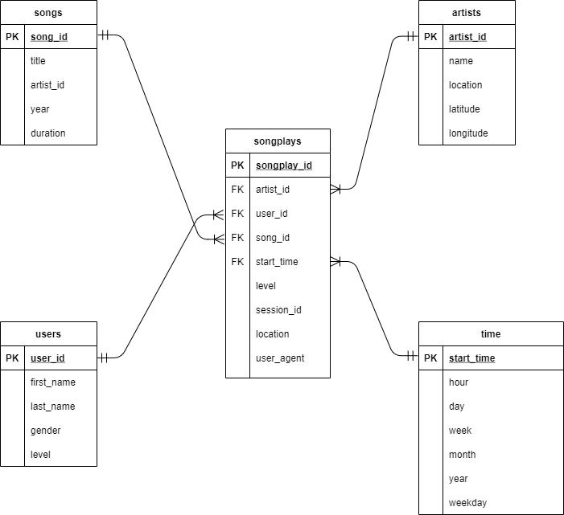

#**Project: Data Modeling with Postgres**

#Project Summary
The Project involves creation of a database schema and ETL pipeline for the Sparkify.
Sparkify is a startup which wants to analyze the data they've been collecting on songs and user's activity on their new music streaming app. The analytics team is particularly interested in understanding **what songs users are listening to**. Currently, they don't have an easy way to query their data, which resides in a **directory of JSON logs** on user activity on the app, as well as a **directory with JSON metadata** on the songs in their app.

#**Project Description**
In these project we will create a Postgres database with tables designed to optimize queries on song play analysis, **database schema and ETL pipeline** for this analysis. To complete the project, you will need to define fact and dimension tables for a star schema for a particular analytic focus, and write an ETL pipeline that transfers data from files in two local directories into these tables in Postgres using **Python and SQL**.

#**Project Datasets**
##**Song Dataset**
The first dataset is a subset of real data from the Million Song Dataset. Each file is in JSON format and contains metadata about a song and the artist of that song. The files are partitioned by the first three letters of each song's track ID. For example, here are filepaths to two files in this dataset.
>song_data/A/B/C/TRABCEI128F424C983.json
>song_data/A/A/B/TRAABJL12903CDCF1A.json

And below is an example of what a single song file, TRAABJL12903CDCF1A.json, looks like.
'''javascript
{"num_songs": 1, "artist_id": "ARJIE2Y1187B994AB7", "artist_latitude": null, "artist_longitude": null, "artist_location": "", "artist_name": "Line Renaud", "song_id": "SOUPIRU12A6D4FA1E1", "title": "Der Kleine Dompfaff", "duration": 152.92036, "year": 0}
'''

##**Log Dataset**
The second dataset consists of log files in JSON format generated by this event simulator based on the songs in the dataset above. These simulate activity logs from a music streaming app based on specified configurations.
The log files in the dataset you'll be working with are partitioned by year and month. For example, here are filepaths to two files in this dataset.
>log_data/2018/11/2018-11-12-events.json
>log_data/2018/11/2018-11-13-events.json

If you would like to look at the JSON data within log_data files, you will need to create a pandas dataframe to read the data. Remember to first import JSON and pandas libraries.

>df = pd.read_json(filepath, lines=True)

For example,
>df = pd.read_json('data/log_data/2018/11/2018-11-01-events.json', lines=True)

would read the data file 2018-11-01-events.json.

##**Schema for Song Play Analysis**
Using the song and log datasets, you'll need to create a star schema optimized for queries on song play analysis. This includes the following tables.

**Fact Table**
1.**songplays** - records in log data associated with song plays i.e. records with page NextSong
  -songplay_id, start_time, user_id, level, song_id, artist_id, session_id, location, user_agent

**Dimension Tables**
2.**users** - users in the app
  -user_id, first_name, last_name, gender, level

3.**songs** - songs in music database
  -user_id, first_name, last_name, gender, level

4.**artists** - artists in music database
  -artist_id, name, location, latitude, longitude

5.**time** - timestamps of records in **songplays** broken down into specific units
  -start_time, hour, day, week, month, year, weekday

##**Files**
-create_tables.py
Creates and drops the tables. Running this file resets the tables before each time we run ETL scripts.
-etl.ipynb
Reads and processes a single file from song_data and log_data and loads the data into your tables. This notebook contains detailed instructions on the ETL process for each of the tables.
-etl.py
Reads and processes files from song_data and log_data and loads them into your tables. You can fill this out based on your work in the ETL notebook.
-sql_queries.py
Contains all your sql queries, and is imported into the last three files above.
-test.ipynb
Displays the first few rows of each table to let you check your database.
